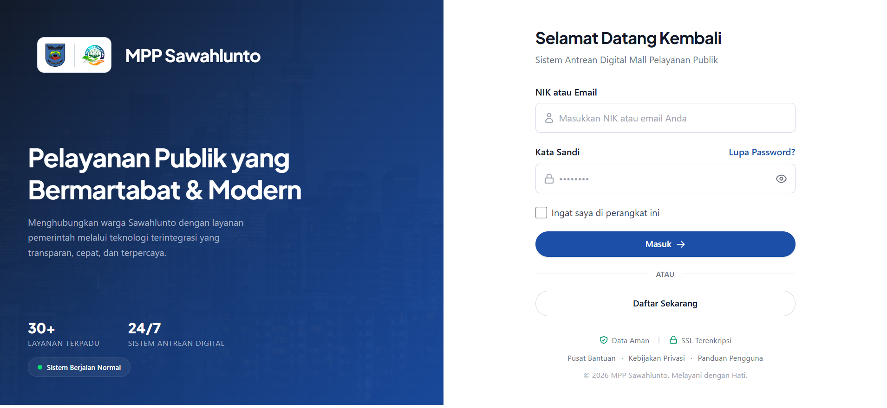
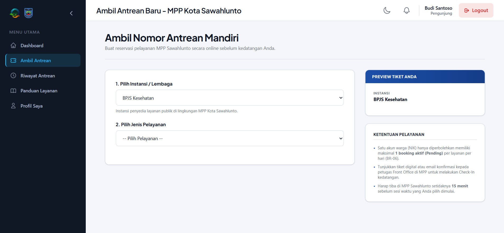
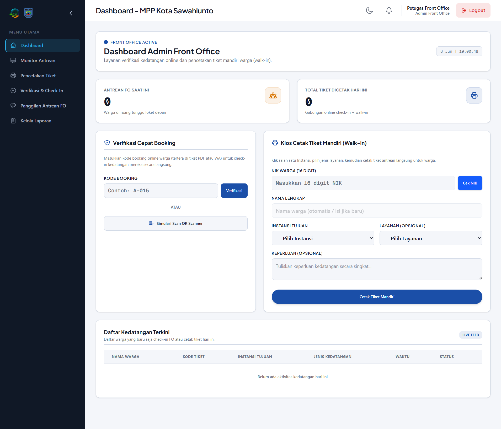
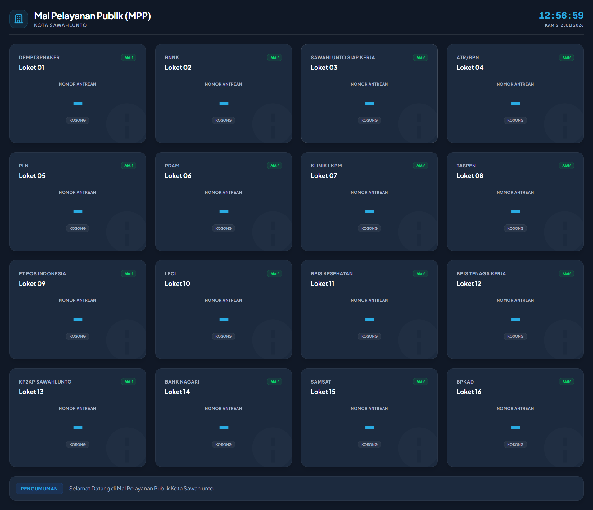

# Sistem Manajemen Antrean MPP Sawahlunto - Spektra

Sistem Manajemen Antrean Digital Mal Pelayanan Publik (MPP) Kota Sawahlunto adalah sebuah platform berbasis web yang dikembangkan untuk mendigitalisasi proses antrean fisik di lingkungan MPP Kota Sawahlunto. Platform ini dirancang khusus untuk mengatasi penumpukan antrean fisik di berbagai loket instansi pemerintah, meningkatkan efisiensi operasional petugas, serta menyajikan transparansi estimasi waktu tunggu bagi masyarakat secara real-time.

Sistem ini dikembangkan sebagai bagian dari proyek Project-Based Learning (PBL) oleh tim **SPEKTRA** untuk memenuhi kebutuhan administrasi publik yang modern, andal, dan ramah pengguna (Civic-Digital).

---

## 🚀 Fitur Utama

Sistem ini terdiri dari beberapa modul inti yang terintegrasi secara harmonis:

1. **Autentikasi & Otorisasi Multi-Role**: Sistem registrasi mandiri untuk Pengunjung (Warga), serta akses terproteksi menggunakan Role-Based Access Control (RBAC) untuk peran `super_admin`, `front_office` (FO), `gerai` (operator loket), dan `customer` (pengunjung).
2. **Booking Mandiri (Reservasi Online)**: Pengunjung dapat memesan slot antrean secara online sebelum datang ke lokasi, mendapatkan kode booking unik berbasis UUID v4, serta menerima konfirmasi informasi kuota dan syarat dokumen secara detail.
3. **Verifikasi Lapangan & Check-In**: Petugas Front Office memverifikasi kode booking pengunjung (manual maupun scan QR code) dan mengonversinya menjadi nomor antrean aktif.
4. **Registrasi Walk-In (Tiket Mandiri)**: Penerbitan tiket antrean secara langsung oleh petugas Front Office bagi pengunjung yang datang tanpa melakukan booking online sebelumnya (khususnya untuk warga tanpa perangkat pintar).
5. **Pemanggilan Antrean Real-Time**: Antarmuka papan pemanggil dinamis bagi operator gerai untuk memanggil (`call`), melayani (`serving`), menyelesaikan (`completed`), atau melewatkan (`skipped`) antrean, dilengkapi fitur penyiaran suara bel pemanggilan antrean otomatis.
6. **Layar Monitor Antrean Publik**: Halaman display utama (`/display`) yang dapat diakses tanpa login untuk dipajang di ruang tunggu MPP, memperbarui data nomor antrean secara instan melalui WebSockets.
7. **Laporan & Analitik**: Modul khusus Super Admin untuk melihat statistik kunjungan harian, melacak performa gerai, dan mengekspor laporan rekapitulasi data ke format PDF dan Excel.
8. **Pengisian Feedback & Rating**: Pengunjung dapat memberikan penilaian bintang 1-5 dan ulasan performa pelayanan sebagai bahan evaluasi internal manajemen MPP.

---

## 🛠️ Tech Stack & Dependencies

Sistem ini dibangun menggunakan arsitektur modern dalam ekosistem PHP dan Laravel:

- **Framework**: Laravel 13.x
- **Database**: MySQL 8.0+
- **CSS Styling**: TailwindCSS 4.x
- **Real-Time Engine**: Pusher / Soketi (WebSocket Broadcasting)
- **Ekspor Dokumen**:
  - `barryvdh/laravel-dompdf` (Format PDF)
  - `maatwebsite/excel` (Format Excel)
- **Manajemen Akses**: `spatie/laravel-permission` (RBAC)
- **Lingkungan Pengembangan (Dev Environment)**: Windows dengan Laragon

---

## 💻 Instalasi Cepat

Ikuti langkah-langkah di bawah ini untuk menjalankan proyek di lingkungan lokal Anda (disarankan menggunakan Laragon di Windows):

### 1. Kloning Repositori
```bash
git clone https://github.com/zakyrmh/pbl-spektra.git
cd pbl-spektra
```

### 2. Instalasi Dependency
Instal seluruh package PHP yang dibutuhkan aplikasi:
```bash
composer install
```

Instal package Javascript untuk front-end aset:
```bash
npm install
```

### 3. Konfigurasi Lingkungan (.env)
Salin file konfigurasi lingkungan dari template `.env.example`:
```bash
cp .env.example .env
```
Buka file `.env` yang baru dibuat dan sesuaikan konfigurasi database Anda (DB_DATABASE, DB_USERNAME, DB_PASSWORD), serta konfigurasi kredensial **Pusher** untuk mendukung broadcasting antrean real-time.

### 4. Generate Application Key
```bash
php artisan key:generate
```

### 5. Migrasi & Seeding Database
Jalankan migrasi tabel beserta data awal bawaan (seeds) untuk role, instansi gerai, dan pengguna demo:
```bash
php artisan migrate --seed
```

### 6. Kompilasi Aset Front-End
Jalankan bundler Vite untuk development:
```bash
npm run dev
```

### 7. Jalankan Server Lokal
Jika Anda tidak menggunakan virtual host bawaan Laragon, Anda dapat menjalankan server bawaan Laravel:
```bash
php artisan serve
```
Aplikasi akan dapat diakses melalui browser pada alamat [http://127.0.0.1:8000](http://127.0.0.1:8000).

---

## 📸 Screenshots & Antarmuka Aplikasi

Berikut adalah pratinjau beberapa halaman utama aplikasi:

### 1. Halaman Login Utama

*Antarmuka masuk bagi pengunjung maupun petugas dengan sistem verifikasi email dan reset password terintegrasi.*

### 2. Halaman Ambil Nomor Antrean (Reservasi Mandiri)

*Halaman bagi pengunjung terdaftar untuk memilih instansi gerai, tanggal kunjungan, serta melihat kuota sisa layanan.*

### 3. Panel Dashboard Operator Front Office

*Antarmuka kerja petugas Front Office untuk melakukan check-in verifikasi kode booking dan pendaftaran tiket walk-in.*

### 4. Papan Pemanggilan Antrean Gerai

*Tampilan operator gerai untuk memproses siklus hidup antrean pengunjung (Call, Serve, Complete, Skip).*

### 5. Tampilan Layar Monitor Ruang Tunggu (Display Publik)

*Layar monitor publik real-time tanpa autentikasi yang menampilkan nomor antrean aktif per loket.*

---

## 👥 Tim Pengembang (SPEKTRA)

Proyek ini dibangun dan dikembangkan oleh tim SPEKTRA TRPL 2C Politeknik Negeri Padang:

* **Zaky Ramadhan** — *Project Manager / Lead Developer*
* **Naufal Khalil Aldeza** — *Backend & Database Developer*
* **Zahwa Rahmadhani** — *UI/UX Designer & Frontend Developer*
* **Vanisa Virsy** — *Technical Writer & Quality Assurance*
