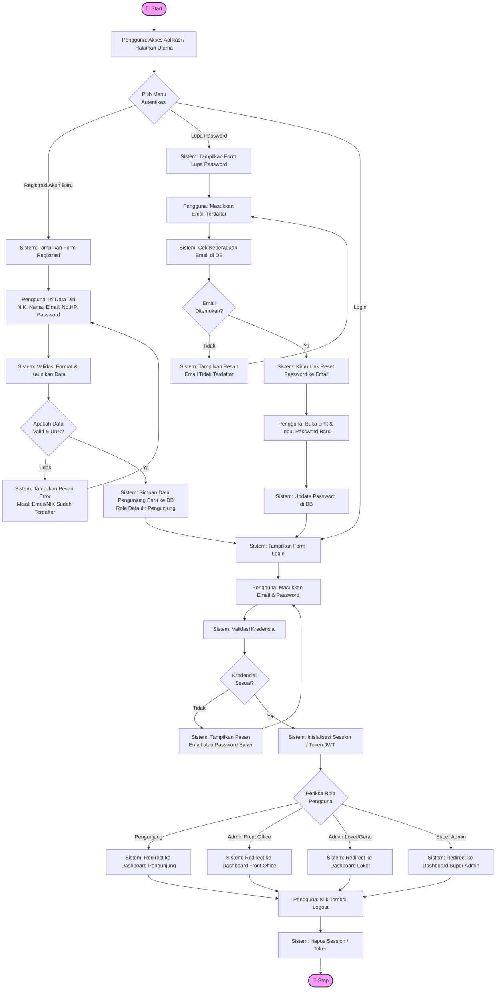

```mermaid
flowchart TD
    %% DEFINISI STYLE
    classDef startEnd fill:#f9f,stroke:#333,stroke-width:2px;
    classDef proses fill:#bbf,stroke:#333,stroke-width:1px;
    classDef kondisi fill:#ff9,stroke:#333,stroke-width:1px;

    Start([🎯 Start]):::startEnd
    End([🛑 Stop]):::startEnd

    %% LOKASI UTAMA / GATEWAY
    Start --> UC2_1[Pengguna: Akses Aplikasi / Halaman Utama]
    UC2_1 --> MenuAuth{Pilih Menu\nAutentikasi}

    %% ==========================================
    %% JALUR 1: REGISTRASI (KHAS PENGUNJUNG)
    %% ==========================================
    MenuAuth -->|Registrasi Akun Baru| Reg_1[Sistem: Tampilkan Form Registrasi]
    Reg_1 --> Reg_2[Pengguna: Isi Data Diri\nNIK, Nama, Email, No.HP, Password]
    Reg_2 --> Reg_3[Sistem: Validasi Format & Keunikan Data]
    Reg_3 --> RegCheck{Apakah Data\nValid & Unik?}
    RegCheck -->|Tidak| RegErr[Sistem: Tampilkan Pesan Error\nMisal: Email/NIK Sudah Terdaftar] --> Reg_2
    RegCheck -->|Ya| RegSimpan[Sistem: Simpan Data Pengunjung Baru ke DB\nRole Default: Pengunjung] --> Log_1

    %% ==========================================
    %% JALUR 2: LUPA PASSWORD
    %% ==========================================
    MenuAuth -->|Lupa Password| Pass_1[Sistem: Tampilkan Form Lupa Password]
    Pass_1 --> Pass_2[Pengguna: Masukkan Email Terdaftar]
    Pass_2 --> Pass_3[Sistem: Cek Keberadaan Email di DB]
    Pass_3 --> PassCheck{Email\nDitemukan?}
    PassCheck -->|Tidak| PassErr[Sistem: Tampilkan Pesan\nEmail Tidak Terdaftar] --> Pass_2
    PassCheck -->|Ya| PassKirim[Sistem: Kirim Link Reset Password ke Email]
    PassKirim --> Pass_4[Pengguna: Buka Link & Input Password Baru]
    Pass_4 --> PassUpdate[Sistem: Update Password di DB] --> Log_1

    %% ==========================================
    %% JALUR 3: LOGIN (CORE FEATURE)
    %% ==========================================
    MenuAuth -->|Login| Log_1[Sistem: Tampilkan Form Login]
    Log_1 --> Log_2[Pengguna: Masukkan Email & Password]
    Log_2 --> Log_3[Sistem: Validasi Kredensial]
    Log_3 --> LogCheck{Kredensial\nSesuai?}
    LogCheck -->|Tidak| LogErr[Sistem: Tampilkan Pesan\nEmail atau Password Salah] --> Log_2

    %% ==========================================
    %% ROUTING ROLE SETELAH LOGIN SUKSES
    %% ==========================================
    LogCheck -->|Ya| Role_1[Sistem: Inisialisasi Session / Token JWT]
    Role_1 --> RoleCheck{Periksa Role\nPengguna}

    RoleCheck -->|Pengunjung| Dash_P[Sistem: Redirect ke Dashboard Pengunjung]
    RoleCheck -->|Admin Front Office| Dash_FO[Sistem: Redirect ke Dashboard Front Office]
    RoleCheck -->|Admin Loket/Gerai| Dash_L[Sistem: Redirect ke Dashboard Loket]
    RoleCheck -->|Super Admin| Dash_SA[Sistem: Redirect ke Dashboard Super Admin]

    %% MENU LOGOUT (SIKLUS AKHIR)
    Dash_P --> LogOut[Pengguna: Klik Tombol Logout]
    Dash_FO --> LogOut
    Dash_L --> LogOut
    Dash_SA --> LogOut

    LogOut --> DestroySession[Sistem: Hapus Session / Token] --> End
```
