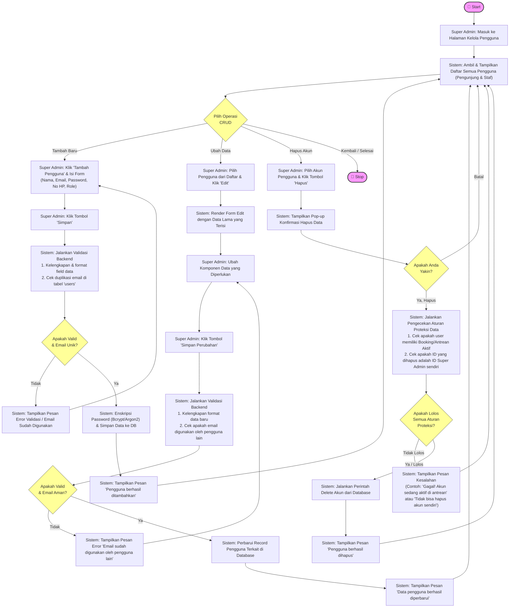

```mermaid
flowchart TD
    %% DEFINISI STYLE
    classDef startEnd fill:#f9f,stroke:#333,stroke-width:2px;
    classDef proses fill:#bbf,stroke:#333,stroke-width:1px;
    classDef kondisi fill:#ff9,stroke:#333,stroke-width:1px;

    Start([🎯 Start])
    End([🛑 Stop])
    class Start,End startEnd;

    %% GERBANG UTAMA DASHBOARD
    Start --> SA_Dash["Super Admin: Masuk ke Halaman Kelola Pengguna"]
    SA_Dash --> S_List["Sistem: Ambil & Tampilkan Daftar Semua Pengguna (Pengunjung & Staf)"]
    S_List --> Gate_CRUD{Pilih Operasi\nCRUD}:::kondisi

    %% ==========================================
    %% JALUR 1: TAMBAH DATA PENGGUNA (UC-01)
    %% ==========================================
    Gate_CRUD -->|"Tambah Baru"| SA_Add["Super Admin: Klik 'Tambah Pengguna' & Isi Form\n(Nama, Email, Password, No HP, Role)"]
    SA_Add --> SA_SaveAdd["Super Admin: Klik Tombol 'Simpan'"]

    SA_SaveAdd --> S_ValAdd["Sistem: Jalankan Validasi Backend\n1. Kelengkapan & format field data\n2. Cek duplikasi email di tabel 'users'"]

    S_ValAdd --> Cond_Add{Apakah Valid\n& Email Unik?}:::kondisi
    Cond_Add -->|Tidak| S_ErrAdd["Sistem: Tampilkan Pesan Error Validasi / Email Sudah Digunakan"] --> SA_Add

    Cond_Add -->|Ya| S_StoreAdd["Sistem: Enskripsi Password (Bcrypt/Argon2) & Simpan Data ke DB"]
    S_StoreAdd --> S_SuccessAdd["Sistem: Tampilkan Pesan 'Pengguna berhasil ditambahkan'"] --> S_List

    %% ==========================================
    %% JALUR 2: UBAH DATA PENGGUNA (UC-02)
    %% ==========================================
    Gate_CRUD -->|"Ubah Data"| SA_SelectEdit["Super Admin: Pilih Pengguna dari Daftar & Klik 'Edit'"]
    SA_SelectEdit --> S_ShowEdit["Sistem: Render Form Edit dengan Data Lama yang Terisi"]
    S_ShowEdit --> SA_Edit["Super Admin: Ubah Komponen Data yang Diperlukan"]
    SA_Edit --> SA_SaveEdit["Super Admin: Klik Tombol 'Simpan Perubahan'"]

    SA_SaveEdit --> S_ValEdit["Sistem: Jalankan Validasi Backend\n1. Kelengkapan format data baru\n2. Cek apakah email digunakan oleh pengguna lain"]

    S_ValEdit --> Cond_Edit{Apakah Valid\n& Email Aman?}:::kondisi
    Cond_Edit -->|Tidak| S_ErrEdit["Sistem: Tampilkan Pesan Error 'Email sudah digunakan oleh pengguna lain'"] --> SA_Edit

    Cond_Edit -->|Ya| S_UpdateEdit["Sistem: Perbarui Record Pengguna Terkait di Database"]
    S_UpdateEdit --> S_SuccessEdit["Sistem: Tampilkan Pesan 'Data pengguna berhasil diperbarui'"] --> S_List

    %% ==========================================
    %% JALUR 3: HAPUS DATA PENGGUNA (UC-03)
    %% ==========================================
    Gate_CRUD -->|"Hapus Akun"| SA_SelectDel["Super Admin: Pilih Akun Pengguna & Klik Tombol 'Hapus'"]
    SA_SelectDel --> S_ConfDel["Sistem: Tampilkan Pop-up Konfirmasi Hapus Data"]
    S_ConfDel --> SA_ConfDel{Apakah Anda\nYakin?}:::kondisi

    SA_ConfDel -->|Batal| S_List

    SA_ConfDel -->|"Ya, Hapus"| S_CheckDel["Sistem: Jalankan Pengecekan Aturan Proteksi Data\n1. Cek apakah user memiliki Booking/Antrean Aktif\n2. Cek apakah ID yang dihapus adalah ID Super Admin sendiri"]

    S_CheckDel --> Cond_Del{Apakah Lolos\nSemua Aturan\nProteksi?}:::kondisi

    %% JALUR BLOKIR HAPUS
    Cond_Del -->|Tidak Lolos| S_ErrDel["Sistem: Tampilkan Pesan Kesalahan\n(Contoh: 'Gagal! Akun sedang aktif di antrean' atau 'Tidak bisa hapus akun sendiri')"] --> S_List

    %% JALUR SUKSES HAPUS
    Cond_Del -->|Ya / Lolos| S_DestroyDel["Sistem: Jalankan Perintah Delete Akun dari Database"]
    S_DestroyDel --> S_SuccessDel["Sistem: Tampilkan Pesan 'Pengguna berhasil dihapus'"] --> S_List

    %% KELUAR DARI HALAMAN KELOLA
    Gate_CRUD -->|"Kembali / Selesai"| End
```
