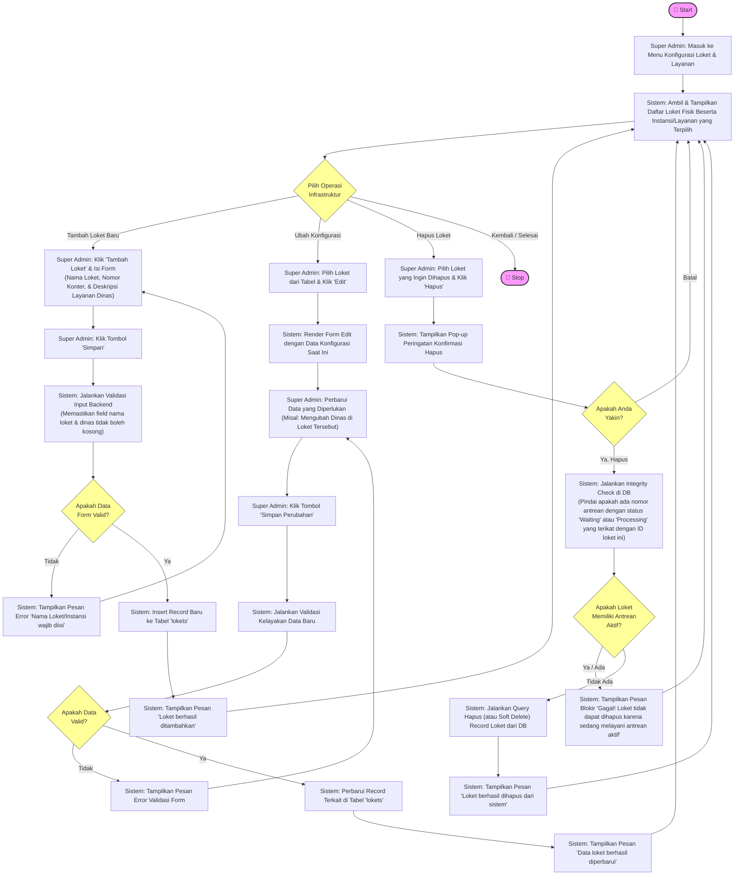

```mermaid
flowchart TD
    %% DEFINISI STYLE
    classDef startEnd fill:#f9f,stroke:#333,stroke-width:2px;
    classDef proses fill:#bbf,stroke:#333,stroke-width:1px;
    classDef kondisi fill:#ff9,stroke:#333,stroke-width:1px;

    Start([🎯 Start])
    End([🛑 Stop])
    class Start,End startEnd;

    %% GERBANG UTAMA DASHBOARD
    Start --> SA_Dash["Super Admin: Masuk ke Menu Konfigurasi Loket & Layanan"]
    SA_Dash --> S_List["Sistem: Ambil & Tampilkan Daftar Loket Fisik Beserta Instansi/Layanan yang Terpilih"]
    S_List --> Gate_CRUD{Pilih Operasi\nInfrastruktur}:::kondisi

    %% ==========================================
    %% JALUR 1: TAMBAH DATA LOKET (UC-01)
    %% ==========================================
    Gate_CRUD -->|"Tambah Loket Baru"| SA_Add["Super Admin: Klik 'Tambah Loket' & Isi Form\n(Nama Loket, Nomor Konter, & Deskripsi Layanan Dinas)"]
    SA_Add --> SA_SaveAdd["Super Admin: Klik Tombol 'Simpan'"]

    SA_SaveAdd --> S_ValAdd["Sistem: Jalankan Validasi Input Backend\n(Memastikan field nama loket & dinas tidak boleh kosong)"]
    S_ValAdd --> Cond_Add{Apakah Data\nForm Valid?}:::kondisi

    Cond_Add -->|Tidak| S_ErrAdd["Sistem: Tampilkan Pesan Error 'Nama Loket/Instansi wajib diisi'"] --> SA_Add

    Cond_Add -->|Ya| S_StoreAdd["Sistem: Insert Record Baru ke Tabel 'lokets'"]
    S_StoreAdd --> S_SuccessAdd["Sistem: Tampilkan Pesan 'Loket berhasil ditambahkan'"] --> S_List

    %% ==========================================
    %% JALUR 2: UBAH DATA LOKET (UC-02)
    %% ==========================================
    Gate_CRUD -->|"Ubah Konfigurasi"| SA_SelectEdit["Super Admin: Pilih Loket dari Tabel & Klik 'Edit'"]
    SA_SelectEdit --> S_ShowEdit["Sistem: Render Form Edit dengan Data Konfigurasi Saat Ini"]
    S_ShowEdit --> SA_Edit["Super Admin: Perbarui Data yang Diperlukan (Misal: Mengubah Dinas di Loket Tersebut)"]
    SA_Edit --> SA_SaveEdit["Super Admin: Klik Tombol 'Simpan Perubahan'"]

    SA_SaveEdit --> S_ValEdit["Sistem: Jalankan Validasi Kelayakan Data Baru"]
    S_ValEdit --> Cond_Edit{Apakah Data\nValid?}:::kondisi

    Cond_Edit -->|Tidak| S_ErrEdit["Sistem: Tampilkan Pesan Error Validasi Form"] --> SA_Edit

    Cond_Edit -->|Ya| S_UpdateEdit["Sistem: Perbarui Record Terkait di Tabel 'lokets'"]
    S_UpdateEdit --> S_SuccessEdit["Sistem: Tampilkan Pesan 'Data loket berhasil diperbarui'"] --> S_List

    %% ==========================================
    %% JALUR 3: HAPUS DATA LOKET (UC-03)
    %% ==========================================
    Gate_CRUD -->|"Hapus Loket"| SA_SelectDel["Super Admin: Pilih Loket yang Ingin Dihapus & Klik 'Hapus'"]
    SA_SelectDel --> S_ConfDel["Sistem: Tampilkan Pop-up Peringatan Konfirmasi Hapus"]
    S_ConfDel --> SA_ConfDel{Apakah Anda\nYakin?}:::kondisi

    SA_ConfDel -->|Batal| S_List

    SA_ConfDel -->|"Ya, Hapus"| S_CheckQueues["Sistem: Jalankan Integrity Check di DB\n(Pindai apakah ada nomor antrean dengan status 'Waiting' atau 'Processing' yang terikat dengan ID loket ini)"]

    S_CheckQueues --> Cond_Del{Apakah Loket\nMemiliki Antrean\nAktif?}:::kondisi

    %% PROTEKSI DATA (GAGAL HAPUS)
    Cond_Del -->|Ya / Ada| S_ErrDel["Sistem: Tampilkan Pesan Blokir 'Gagal! Loket tidak dapat dihapus karena sedang melayani antrean aktif'"] --> S_List

    %% SUKSES HAPUS
    Cond_Del -->|Tidak Ada| S_DestroyDel["Sistem: Jalankan Query Hapus (atau Soft Delete) Record Loket dari DB"]
    S_DestroyDel --> S_SuccessDel["Sistem: Tampilkan Pesan 'Loket berhasil dihapus dari sistem'"] --> S_List

    %% KELUAR DARI HALAMAN
    Gate_CRUD -->|"Kembali / Selesai"| End
```
