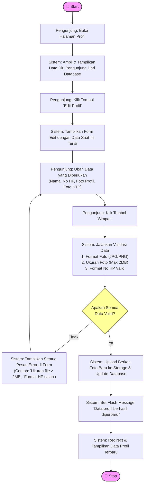

```mermaid
flowchart TD
    %% DEFINISI STYLE
    classDef startEnd fill:#f9f,stroke:#333,stroke-width:2px;
    classDef proses fill:#bbf,stroke:#333,stroke-width:1px;
    classDef kondisi fill:#ff9,stroke:#333,stroke-width:1px;

    Start([🎯 Start])
    End([🛑 Stop])
    class Start,End startEnd;

    %% ALUR AKTIVITAS
    Start --> P1["Pengunjung: Buka Halaman Profil"]
    P1 --> S1["Sistem: Ambil & Tampilkan Data Diri Pengunjung Dari Database"]

    S1 --> P2["Pengunjung: Klik Tombol 'Edit Profil'"]
    P2 --> S2["Sistem: Tampilkan Form Edit dengan Data Saat Ini Terisi"]

    S2 --> P3["Pengunjung: Ubah Data yang Diperlukan\n(Nama, No HP, Foto Profil, Foto KTP)"]
    P3 --> P4["Pengunjung: Klik Tombol 'Simpan'"]

    %% PROSES VALIDASI TERPADU (LARAVEL FORM REQUEST STYLE)
    P4 --> S3["Sistem: Jalankan Validasi Data\n1. Format Foto (JPG/PNG)\n2. Ukuran Foto (Max 2MB)\n3. Format No HP Valid"]

    S3 --> Cond1{Apakah Semua\nData Valid?}:::kondisi

    %% JALUR TIDAK VALID (KEMBALI KE FORM DENGAN ERROR)
    Cond1 -->|Tidak| S4["Sistem: Tampilkan Semua Pesan Error di Form\n(Contoh: 'Ukuran file > 2MB', 'Format HP salah')"]
    S4 --> P3

    %% JALUR VALID (SUKSES)
    Cond1 -->|Ya| S5["Sistem: Upload Berkas Foto Baru ke Storage & Update Database"]
    S5 --> S6["Sistem: Set Flash Message 'Data profil berhasil diperbarui'"]
    S6 --> S7["Sistem: Redirect & Tampilkan Data Profil Terbaru"]
    S7 --> End
```
