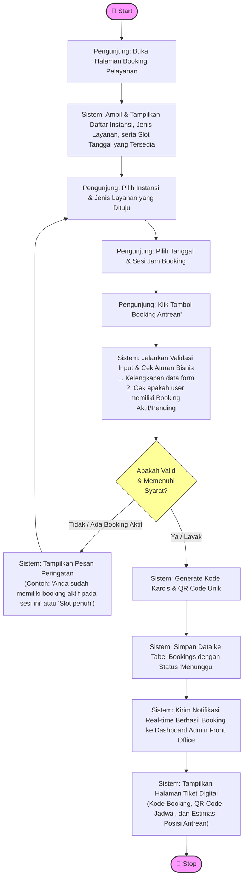

```mermaid
flowchart TD
    %% DEFINISI STYLE
    classDef startEnd fill:#f9f,stroke:#333,stroke-width:2px;
    classDef proses fill:#bbf,stroke:#333,stroke-width:1px;
    classDef kondisi fill:#ff9,stroke:#333,stroke-width:1px;

    Start([🎯 Start])
    End([🛑 Stop])
    class Start,End startEnd;

    %% ALUR AKTIVITAS
    Start --> P1["Pengunjung: Buka Halaman Booking Pelayanan"]
    P1 --> S1["Sistem: Ambil & Tampilkan Daftar Instansi, Jenis Layanan, serta Slot Tanggal yang Tersedia"]

    S1 --> P2["Pengunjung: Pilih Instansi & Jenis Layanan yang Dituju"]
    P2 --> P3["Pengunjung: Pilih Tanggal & Sesi Jam Booking"]
    P3 --> P4["Pengunjung: Klik Tombol 'Booking Antrean'"]

    %% GERBANG VALIDASI DAN ATURAN BISNIS (BACKEND LARAVEL)
    P4 --> S2["Sistem: Jalankan Validasi Input & Cek Aturan Bisnis\n1. Kelengkapan data form\n2. Cek apakah user memiliki Booking Aktif/Pending"]

    S2 --> Cond1{Apakah Valid\n& Memenuhi\nSyarat?}:::kondisi

    %% JALUR JIKA GAGAL/SUDAH ADA BOOKING
    Cond1 -->|Tidak / Ada Booking Aktif| S3["Sistem: Tampilkan Pesan Peringatan\n(Contoh: 'Anda sudah memiliki booking aktif pada sesi ini' atau 'Slot penuh')"]
    S3 --> P2

    %% JALUR JIKA LAYAK (SUKSES)
    Cond1 -->|Ya / Layak| S4["Sistem: Generate Kode Karcis & QR Code Unik"]
    S4 --> S5["Sistem: Simpan Data ke Tabel Bookings dengan Status 'Menunggu'"]

    %% REAL-TIME NOTIFICATION (PEMBERITAHUAN KE FO)
    S5 --> S6["Sistem: Kirim Notifikasi Real-time Berhasil Booking ke Dashboard Admin Front Office"]

    %% INTEGRASI UC-26 (LIHAT STATUS & POSISI ANTREAN)
    S6 --> S7["Sistem: Tampilkan Halaman Tiket Digital\n(Kode Booking, QR Code, Jadwal, dan Estimasi Posisi Antrean)"]
    S7 --> End
```
