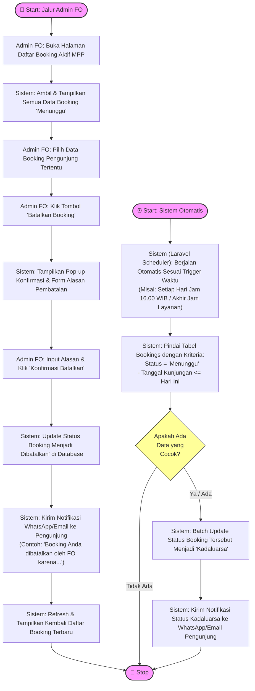

```mermaid
flowchart TD
    %% DEFINISI STYLE
    classDef startEnd fill:#f9f,stroke:#333,stroke-width:2px;
    classDef proses fill:#bbf,stroke:#333,stroke-width:1px;
    classDef kondisi fill:#ff9,stroke:#333,stroke-width:1px;

    Start1(["🎯 Start: Jalur Admin FO"])
    Start2(["⏰ Start: Sistem Otomatis"])
    End(["🛑 Stop"])
    class Start1,Start2,End startEnd;

    %% ==========================================
    %% JALUR 1: PEMBATALAN MANUAL OLEH ADMIN FO
    %% ==========================================
    Start1 --> FO1["Admin FO: Buka Halaman Daftar Booking Aktif MPP"]
    FO1 --> S1["Sistem: Ambil & Tampilkan Semua Data Booking 'Menunggu'"]

    S1 --> FO2["Admin FO: Pilih Data Booking Pengunjung Tertentu"]
    FO2 --> FO3["Admin FO: Klik Tombol 'Batalkan Booking'"]

    FO3 --> S2["Sistem: Tampilkan Pop-up Konfirmasi & Form Alasan Pembatalan"]
    S2 --> FO4["Admin FO: Input Alasan & Klik 'Konfirmasi Batalkan'"]

    FO4 --> S3["Sistem: Update Status Booking Menjadi 'Dibatalkan' di Database"]
    S3 --> S_Notif1["Sistem: Kirim Notifikasi WhatsApp/Email ke Pengunjung\n(Contoh: 'Booking Anda dibatalkan oleh FO karena...')"]
    S_Notif1 --> S_Refresh["Sistem: Refresh & Tampilkan Kembali Daftar Booking Terbaru"]
    S_Refresh --> End

    %% ==========================================
    %% JALUR 2: KADALUARSA OTOMATIS (BACKGROUND JOB)
    %% ==========================================
    Start2 --> S4["Sistem (Laravel Scheduler): Berjalan Otomatis Sesuai Trigger Waktu\n(Misal: Setiap Hari Jam 16.00 WIB / Akhir Jam Layanan)"]
    S4 --> S5["Sistem: Pindai Tabel Bookings dengan Kriteria:\n- Status = 'Menunggu'\n- Tanggal Kunjungan <= Hari Ini"]

    S5 --> Cond1{Apakah Ada\nData yang\nCocok?}:::kondisi

    Cond1 -->|Tidak Ada| End

    Cond1 -->|Ya / Ada| S6["Sistem: Batch Update Status Booking Tersebut Menjadi 'Kadaluarsa'"]
    S6 --> S_Notif2["Sistem: Kirim Notifikasi Status Kadaluarsa ke WhatsApp/Email Pengunjung"]
    S_Notif2 --> End
```
