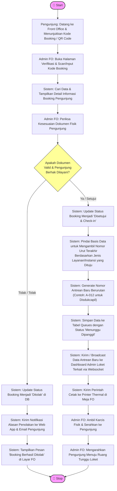

```mermaid
flowchart TD
%% DEFINISI STYLE
classDef startEnd fill:#f9f,stroke:#333,stroke-width:2px;
classDef proses fill:#bbf,stroke:#333,stroke-width:1px;
classDef kondisi fill:#ff9,stroke:#333,stroke-width:1px;

    Start([🎯 Start])
    End([🛑 Stop])
    class Start,End startEnd;

    %% ALUR KEDATANGAN DI LAPANGAN
    Start --> P1["Pengunjung: Datang ke Front Office & Menunjukkan Kode Booking / QR Code"]
    P1 --> FO1["Admin FO: Buka Halaman Verifikasi & Scan/Input Kode Booking"]

    %% TAMPILAN DETAIL
    FO1 --> S1["Sistem: Cari Data & Tampilkan Detail Informasi Booking Pengunjung"]
    S1 --> FO2["Admin FO: Periksa Kesesuaian Dokumen Fisik Pengunjung"]

    %% GERBANG KEPUTUSAN VERIFIKASI (UC-05 & UC-02)
    FO2 --> FO3{"Apakah Dokumen\nValid & Pengunjung\nBerhak Dilayani?"}:::kondisi

    %% JALUR JIKA DITOLAK
    FO3 -->|Tidak / Tolak| S2["Sistem: Update Status Booking Menjadi 'Ditolak' di DB"]
    S2 --> S3["Sistem: Kirim Notifikasi Alasan Penolakan ke Web App & Email Pengunjung"]
    S3 --> S4["Sistem: Tampilkan Pesan 'Booking Berhasil Ditolak' di Layar FO"]
    S4 --> End

    %% JALUR JIKA DISETUJUI (OTOMATIS GENERATE ANTREAN - UC-06)
    FO3 -->|Ya / Setujui| S5["Sistem: Update Status Booking Menjadi 'Disetujui & Check-in'"]

    S5 --> S6["Sistem: Pindai Basis Data untuk Mengambil Nomor Urut Terakhir\nBerdasarkan Jenis Layanan/Instansi yang Dituju"]

    S6 --> S7["Sistem: Generate Nomor Antrean Baru Berurutan\n(Contoh: A-012 untuk Disdukcapil)"]

    %% SIMPAN DATA ANTREAN HARIAN
    S7 --> S8["Sistem: Simpan Data ke Tabel Queues dengan Status 'Menunggu Dipanggil'"]

    %% BROADCAST REAL-TIME KE LOKET
    S8 --> S9["Sistem: Kirim / Broadcast Data Antrean Baru ke Dashboard Admin Loket Terkait via Websocket"]

    %% OUTPUT KARCIS
    S9 --> S10["Sistem: Kirim Perintah Cetak ke Printer Thermal di Meja FO"]
    S10 --> FO4["Admin FO: Ambil Karcis Fisik & Serahkan ke Pengunjung"]
    FO4 --> FO5["Admin FO: Mengarahkan Pengunjung Menuju Ruang Tunggu Loket"]
    FO5 --> End
```
