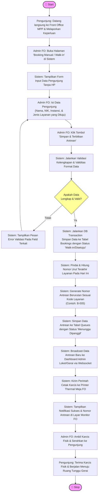

```mermaid
flowchart TD
    %% DEFINISI STYLE
    classDef startEnd fill:#f9f,stroke:#333,stroke-width:2px;
    classDef proses fill:#bbf,stroke:#333,stroke-width:1px;
    classDef kondisi fill:#ff9,stroke:#333,stroke-width:1px;

    Start([🎯 Start])
    End([🛑 Stop])
    class Start,End startEnd;

    %% ALUR WALK-IN
    Start --> P1["Pengunjung: Datang langsung ke Front Office MPP & Melaporkan Keperluan"]
    P1 --> FO1["Admin FO: Buka Halaman 'Booking Manual / Walk-in' di Sistem"]

    FO1 --> S1["Sistem: Tampilkan Form Input Data Pengunjung Tanpa HP"]

    %% INPUT DATA
    S1 --> FO2["Admin FO: Isi Data Pengunjung\n(Nama, NIK, Instansi, & Jenis Layanan yang Dituju)"]
    FO2 --> FO3["Admin FO: Klik Tombol 'Simpan & Terbitkan Antrean'"]

    %% GERBANG VALIDASI FORM (LARAVEL VALIDATION STYLE)
    FO3 --> S2["Sistem: Jalankan Validasi Kelengkapan & Validitas Format Data"]
    S2 --> Cond1{Apakah Data\nLengkap & Valid?}:::kondisi

    %% JALUR JIKA INPUT SALAH/NIK TIDAK VALID
    Cond1 -->|Tidak| S3["Sistem: Tampilkan Pesan Error Validasi Pada Field Terkait"]
    S3 --> FO2

    %% JALUR JIKA LAYAK - EKSEKUSI ATOMIK (UC-05 DAN INCLUDED UC-06)
    Cond1 -->|Ya| S4["Sistem: Jalankan DB Transaction\nSimpan Data ke Tabel Bookings dengan Status 'Walk-in/Disetujui'"]

    %% PROSES INTEGRASI UC-06 (PENERBITAN NOMOR ANTREAN)
    S4 --> S5["Sistem: Pindai & Hitung Nomor Urut Terakhir Layanan Pada Hari Ini"]
    S5 --> S6["Sistem: Generate Nomor Antrean Berurutan Sesuai Kode Layanan\n(Contoh: B-005)"]

    %% SIMPAN DATA ANTREAN
    S6 --> S7["Sistem: Simpan Data Antrean ke Tabel Queues dengan Status 'Menunggu Dipanggil'"]

    %% REAL-TIME BROADCAST KE GERAI LOKET
    S7 --> S8["Sistem: Broadcast Data Antrean Baru ke Dashboard Admin Loket/Gerai via Websocket"]

    %% OUTPUT FISIK
    S8 --> S9["Sistem: Kirim Perintah Cetak Karcis ke Printer Thermal Meja FO"]
    S9 --> S10["Sistem: Tampilkan Notifikasi Sukses & Nomor Antrean di Layar Monitor FO"]

    %% AKHIR PROSES DI LAPANGAN
    S10 --> FO4["Admin FO: Ambil Karcis Fisik & Serahkan ke Pengunjung"]
    FO4 --> P2["Pengunjung: Terima Karcis Fisik & Berjalan Menuju Ruang Tunggu Gerai"]
    P2 --> End
```
