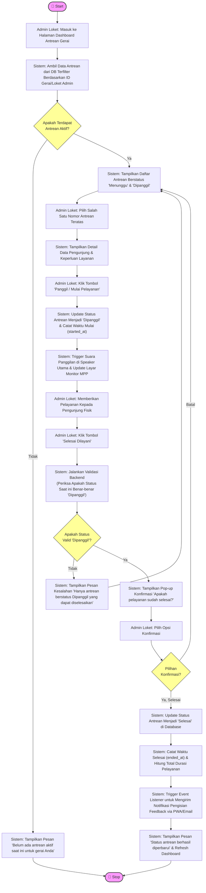

```mermaid
flowchart TD
    %% DEFINISI STYLE
    classDef startEnd fill:#f9f,stroke:#333,stroke-width:2px;
    classDef proses fill:#bbf,stroke:#333,stroke-width:1px;
    classDef kondisi fill:#ff9,stroke:#333,stroke-width:1px;

    Start([🎯 Start])
    End([🛑 Stop])
    class Start,End startEnd;

    %% STEP 1: LIHAT DATA ANTREAN (UC-04)
    Start --> L1["Admin Loket: Masuk ke Halaman Dashboard Antrean Gerai"]
    L1 --> S1["Sistem: Ambil Data Antrean dari DB Terfilter Berdasarkan ID Gerai/Loket Admin"]

    S1 --> Cond1{Apakah Terdapat\nAntrean Aktif?}:::kondisi
    Cond1 -->|Tidak| S2["Sistem: Tampilkan Pesan 'Belum ada antrean aktif saat ini untuk gerai Anda'"] --> End

    %% TAMPILKAN DAFTAR & DETAIL
    Cond1 -->|Ya| S3["Sistem: Tampilkan Daftar Antrean Berstatus 'Menunggu' & 'Dipanggil'"]
    S3 --> L2["Admin Loket: Pilih Salah Satu Nomor Antrean Teratas"]
    L2 --> S4["Sistem: Tampilkan Detail Data Pengunjung & Keperluan Layanan"]

    %% JEMBATAN LOGIS: PROSES MEMANGGIL ANTREAN
    S4 --> L3["Admin Loket: Klik Tombol 'Panggil / Mulai Pelayanan'"]
    L3 --> S5["Sistem: Update Status Antrean Menjadi 'Dipanggil'\n& Catat Waktu Mulai (started_at)"]
    S5 --> S6["Sistem: Trigger Suara Panggilan di Speaker Utama & Update Layar Monitor MPP"]

    %% STEP 2: PROSES MELAYANI & SELESAI (UC-05)
    S6 --> L4["Admin Loket: Memberikan Pelayanan Kepada Pengunjung Fisik"]
    L4 --> L5["Admin Loket: Klik Tombol 'Selesai Dilayani'"]

    %% VALIDASI STATUS BACKEND
    L5 --> S7["Sistem: Jalankan Validasi Backend\n(Periksa Apakah Status Saat ini Benar-benar 'Dipanggil')"]
    S7 --> Cond2{Apakah Status\nValid 'Dipanggil'?}:::kondisi

    %% JALUR ERROR VALIDASI
    Cond2 -->|Tidak| S8["Sistem: Tampilkan Pesan Kesalahan 'Hanya antrean berstatus Dipanggil yang dapat diselesaikan'"]
    S8 --> S3

    %% JALUR VALID - POP-UP KONFIRMASI
    Cond2 -->|Ya| S9["Sistem: Tampilkan Pop-up Konfirmasi 'Apakah pelayanan sudah selesai?'"]
    S9 --> L6["Admin Loket: Pilih Opsi Konfirmasi"]

    %% KEPUTUSAN KONFIRMASI
    L6 --> Cond3{Pilihan\nKonfirmasi?}:::kondisi
    Cond3 -->|Batal| S3

    %% EKSEKUSI SUKSES
    Cond3 -->|Ya, Selesai| S10["Sistem: Update Status Antrean Menjadi 'Selesai' di Database"]
    S10 --> S11["Sistem: Catat Waktu Selesai (ended_at) & Hitung Total Durasi Pelayanan"]

    %% INTEGRASI EVENT NOTIFIKASI FEEDBACK
    S11 --> S12["Sistem: Trigger Event Listener untuk Mengirim Notifikasi Pengisian Feedback via PWA/Email"]
    S12 --> S13["Sistem: Tampilkan Pesan 'Status antrean berhasil diperbarui' & Refresh Dashboard"]
    S13 --> End
```
