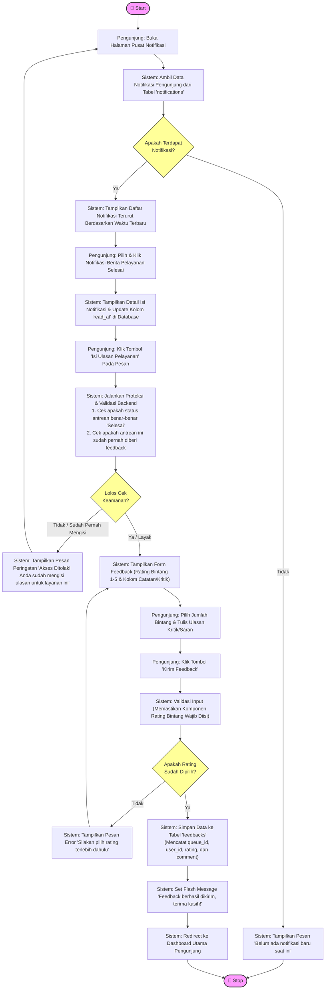

```mermaid
flowchart TD
    %% DEFINISI STYLE
    classDef startEnd fill:#f9f,stroke:#333,stroke-width:2px;
    classDef proses fill:#bbf,stroke:#333,stroke-width:1px;
    classDef kondisi fill:#ff9,stroke:#333,stroke-width:1px;

    Start([🎯 Start])
    End([🛑 Stop])
    class Start,End startEnd;

    %% STEP 1: LIHAT NOTIFIKASI (UC-06 VANI)
    Start --> P1["Pengunjung: Buka Halaman Pusat Notifikasi"]
    P1 --> S1["Sistem: Ambil Data Notifikasi Pengunjung dari Tabel 'notifications'"]

    S1 --> Cond1{Apakah Terdapat\nNotifikasi?}:::kondisi
    Cond1 -->|Tidak| S2["Sistem: Tampilkan Pesan 'Belum ada notifikasi baru saat ini'"] --> End

    Cond1 -->|Ya| S3["Sistem: Tampilkan Daftar Notifikasi Terurut Berdasarkan Waktu Terbaru"]
    S3 --> P2["Pengunjung: Pilih & Klik Notifikasi Berita Pelayanan Selesai"]

    P2 --> S4["Sistem: Tampilkan Detail Isi Notifikasi & Update Kolom 'read_at' di Database"]

    %% JEMBATAN KE FITUR FEEDBACK
    S4 --> P3["Pengunjung: Klik Tombol 'Isi Ulasan Pelayanan' Pada Pesan"]

    %% STEP 2: PROSES ISI FEEDBACK & RATING (UC-06 NAUFAL)
    P3 --> S5["Sistem: Jalankan Proteksi & Validasi Backend\n1. Cek apakah status antrean benar-benar 'Selesai'\n2. Cek apakah antrean ini sudah pernah diberi feedback"]

    S5 --> Cond2{Lolos Cek\nKeamanan?}:::kondisi

    %% JALUR ERROR / CURANG (BYPASS URL)
    Cond2 -->|Tidak / Sudah Pernah Mengisi| S6["Sistem: Tampilkan Pesan Peringatan 'Akses Ditolak! Anda sudah mengisi ulasan untuk layanan ini'"]
    S6 --> P1

    %% JALUR AMAN / BELUM MENGISI
    Cond2 -->|Ya / Layak| S7["Sistem: Tampilkan Form Feedback (Rating Bintang 1-5 & Kolom Catatan/Kritik)"]

    S7 --> P4["Pengunjung: Pilih Jumlah Bintang & Tulis Ulasan Kritik/Saran"]
    P4 --> P5["Pengunjung: Klik Tombol 'Kirim Feedback'"]

    %% VALIDASI FORM INPUT
    P5 --> S8["Sistem: Validasi Input (Memastikan Komponen Rating Bintang Wajib Diisi)"]
    S8 --> Cond3{Apakah Rating\nSudah Dipilih?}:::kondisi

    Cond3 -->|Tidak| S9["Sistem: Tampilkan Pesan Error 'Silakan pilih rating terlebih dahulu'"] --> S7

    %% EKSEKUSI PENYIMPANAN
    Cond3 -->|Ya| S10["Sistem: Simpan Data ke Tabel 'feedbacks'\n(Mencatat queue_id, user_id, rating, dan comment)"]
    S10 --> S11["Sistem: Set Flash Message 'Feedback berhasil dikirim, terima kasih!'"]
    S11 --> S12["Sistem: Redirect ke Dashboard Utama Pengunjung"]
    S12 --> End
```
