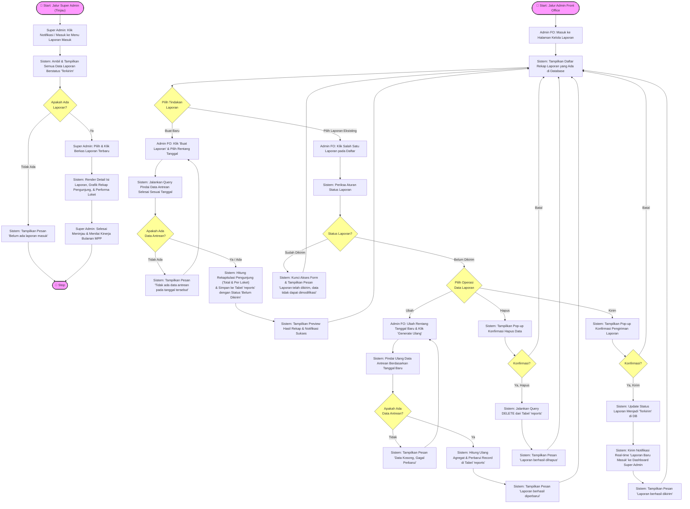

```mermaid
flowchart TD
    %% DEFINISI STYLE
    classDef startEnd fill:#f9f,stroke:#333,stroke-width:2px;
    classDef proses fill:#bbf,stroke:#333,stroke-width:1px;
    classDef kondisi fill:#ff9,stroke:#333,stroke-width:1px;

    StartFO(["🎯 Start: Jalur Admin Front Office"])
    StartSA(["🔔 Start: Jalur Super Admin (Tinjau)"])
    End([🛑 Stop])
    class StartFO,StartSA,End startEnd;

    %% ==========================================
    %% GERBANG UTAMA DASHBOARD FO
    %% ==========================================
    StartFO --> FO_Dash["Admin FO: Masuk ke Halaman Kelola Laporan"]
    FO_Dash --> S_List["Sistem: Tampilkan Daftar Rekap Laporan yang Ada di Database"]
    S_List --> Gate_FO{Pilih Tindakan\nLaporan}:::kondisi

    %% JALUR 1: BUAT LAPORAN BARU (UC-01)
    Gate_FO -->|"Buat Baru"| FO_New["Admin FO: Klik 'Buat Laporan' & Pilih Rentang Tanggal"]
    FO_New --> S_Query1["Sistem: Jalankan Query Pindai Data Antrean Selesai Sesuai Tanggal"]
    S_Query1 --> Cond_Data1{Apakah Ada\nData Antrean?}:::kondisi

    Cond_Data1 -->|Tidak Ada| S_Err1["Sistem: Tampilkan Pesan 'Tidak ada data antrean pada tanggal tersebut'"] --> FO_New

    Cond_Data1 -->|Ya / Ada| S_Save1["Sistem: Hitung Rekapitulasi Pengunjung (Total & Per Loket)\n& Simpan ke Tabel 'reports' dengan Status 'Belum Dikirim'"]
    S_Save1 --> S_Prev1["Sistem: Tampilkan Preview Hasil Rekap & Notifikasi Sukses"] --> S_List

    %% SELEKSI LAPORAN EKSISTING UNTUK MANAJEMEN DATA
    Gate_FO -->|"Pilih Laporan Eksisting"| FO_Select["Admin FO: Klik Salah Satu Laporan pada Daftar"]
    FO_Select --> S_CheckStatus["Sistem: Periksa Aturan Status Laporan"]
    S_CheckStatus --> Cond_Status{Status Laporan?}:::kondisi

    %% PROTEKSI SISTEM: JIKA SUDAH DIKIRIM (AKSES DIKUNCI)
    Cond_Status -->|"Sudah Dikirim"| S_Lock["Sistem: Kunci Akses Form & Tampilkan Pesan 'Laporan telah dikirim, data tidak dapat dimodifikasi'"] --> S_List

    %% JIKA BELUM DIKIRIM (AKSES TERBUKA)
    Cond_Status -->|"Belum Dikirim"| Gate_Manage{Pilih Operasi\nData Laporan}:::kondisi

    %% JALUR 2: UBAH LAPORAN (UC-02)
    Gate_Manage -->|"Ubah"| FO_Edit["Admin FO: Ubah Rentang Tanggal Baru & Klik 'Generate Ulang'"]
    FO_Edit --> S_Query2["Sistem: Pindai Ulang Data Antrean Berdasarkan Tanggal Baru"]
    S_Query2 --> Cond_Data2{Apakah Ada\nData Antrean?}:::kondisi

    Cond_Data2 -->|Tidak| S_Err2["Sistem: Tampilkan Pesan 'Data Kosong, Gagal Perbarui'"] --> FO_Edit

    Cond_Data2 -->|Ya| S_Update2["Sistem: Hitung Ulang Agregat & Perbarui Record di Tabel 'reports'"]
    S_Update2 --> S_Notif2["Sistem: Tampilkan Pesan 'Laporan berhasil diperbarui'"] --> S_List

    %% JALUR 3: HAPUS LAPORAN (UC-03)
    Gate_Manage -->|"Hapus"| S_ConfDel["Sistem: Tampilkan Pop-up Konfirmasi Hapus Data"]
    S_ConfDel --> FO_Del{Konfirmasi?}:::kondisi
    FO_Del -->|Batal| S_List
    FO_Del -->|"Ya, Hapus"| S_Delete["Sistem: Jalankan Query DELETE dari Tabel 'reports'"]
    S_Delete --> S_Notif3["Sistem: Tampilkan Pesan 'Laporan berhasil dihapus'"] --> S_List

    %% JALUR 4: KIRIM LAPORAN KE SUPER ADMIN (UC-04)
    Gate_Manage -->|"Kirim"| S_ConfSend["Sistem: Tampilkan Pop-up Konfirmasi Pengiriman Laporan"]
    S_ConfSend --> FO_Send{Konfirmasi?}:::kondisi
    FO_Send -->|Batal| S_List
    FO_Send -->|"Ya, Kirim"| S_StatusSend["Sistem: Update Status Laporan Menjadi 'Terkirim' di DB"]
    S_StatusSend --> S_TriggerNotif["Sistem: Kirim Notifikasi Real-time 'Laporan Baru Masuk' ke Dashboard Super Admin"]
    S_TriggerNotif --> S_Notif4["Sistem: Tampilkan Pesan 'Laporan berhasil dikirim'"] --> S_List

    %% ==========================================
    %% JALUR 5: TERIMA & TINJAU LAPORAN - SUPER ADMIN (UC-05)
    %% ==========================================
    StartSA --> SA_Notif["Super Admin: Klik Notifikasi / Masuk ke Menu Laporan Masuk"]
    SA_Notif --> S_FetchSA["Sistem: Ambil & Tampilkan Semua Data Laporan Berstatus 'Terkirim'"]

    S_FetchSA --> Cond_SA{Apakah Ada\nLaporan?}:::kondisi
    Cond_SA -->|Tidak Ada| S_EmptySA["Sistem: Tampilkan Pesan 'Belum ada laporan masuk'"] --> End

    Cond_SA -->|Ya| SA_Select["Super Admin: Pilih & Klik Berkas Laporan Terbaru"]
    SA_Select --> S_ShowSA["Sistem: Render Detail Isi Laporan, Grafik Rekap Pengunjung, & Performa Loket"]
    S_ShowSA --> SA_Review["Super Admin: Selesai Meninjau & Menilai Kinerja Bulanan MPP"]
    SA_Review --> End
```
