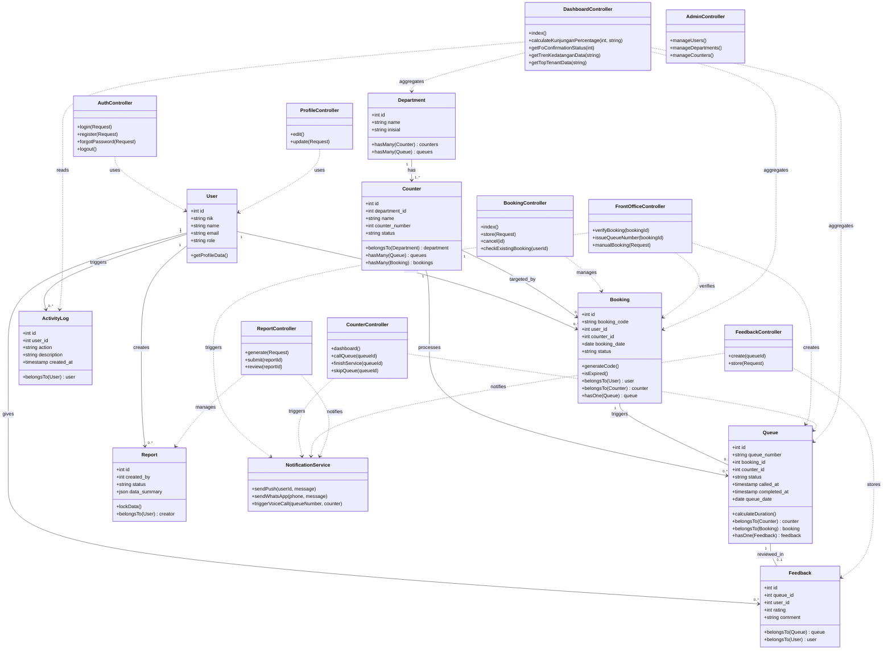

```mermaid
classDiagram
    %% ==========================================
    %% LAYER MODELS (DATABASE REPRESENTATION)
    %% ==========================================
    class User {
        +int id
        +string nik
        +string name
        +string email
        +string role
        +getProfileData()
    }

    class Department {
        +int id
        +string name
        +string inisial
        +hasMany(Counter) counters
        +hasMany(Queue) queues
    }

    class Counter {
        +int id
        +int department_id
        +string name
        +int counter_number
        +string status
        +belongsTo(Department) department
        +hasMany(Queue) queues
        +hasMany(Booking) bookings
    }

    class Booking {
        +int id
        +string booking_code
        +int user_id
        +int counter_id
        +date booking_date
        +string status
        +generateCode()
        +isExpired()
        +belongsTo(User) user
        +belongsTo(Counter) counter
        +hasOne(Queue) queue
    }

    class Queue {
        +int id
        +string queue_number
        +int booking_id
        +int counter_id
        +string status
        +timestamp called_at
        +timestamp completed_at
        +date queue_date
        +calculateDuration()
        +belongsTo(Counter) counter
        +belongsTo(Booking) booking
        +hasOne(Feedback) feedback
    }

    class Feedback {
        +int id
        +int queue_id
        +int user_id
        +int rating
        +string comment
        +belongsTo(Queue) queue
        +belongsTo(User) user
    }

    class Report {
        +int id
        +int created_by
        +string status
        +json data_summary
        +lockData()
        +belongsTo(User) creator
    }

    class ActivityLog {
        +int id
        +int user_id
        +string action
        +string description
        +timestamp created_at
        +belongsTo(User) user
    }

    %% ==========================================
    %% LAYER CONTROLLERS (BUSINESS LOGIC)
    %% ==========================================
    class AuthController {
        +login(Request)
        +register(Request)
        +forgotPassword(Request)
        +logout()
    }

    class ProfileController {
        +edit()
        +update(Request)
    }

    class BookingController {
        +index()
        +store(Request)
        +cancel(id)
        +checkExistingBooking(userId)
    }

    class FrontOfficeController {
        +verifyBooking(bookingId)
        +issueQueueNumber(bookingId)
        +manualBooking(Request)
    }

    class CounterController {
        +dashboard()
        +callQueue(queueId)
        +finishService(queueId)
        +skipQueue(queueId)
    }

    class DashboardController {
        +index()
        +calculateKunjunganPercentage(int, string)
        +getFoConfirmationStatus(int)
        +getTrenKedatanganData(string)
        +getTopTenantData(string)
    }

    class FeedbackController {
        +create(queueId)
        +store(Request)
    }

    class ReportController {
        +generate(Request)
        +submit(reportId)
        +review(reportId)
    }

    class AdminController {
        +manageUsers()
        +manageDepartments()
        +manageCounters()
    }

    %% ==========================================
    %% LAYER SERVICES (HELPER/AUTOMATION)
    %% ==========================================
    class NotificationService {
        +sendPush(userId, message)
        +sendWhatsApp(phone, message)
        +triggerVoiceCall(queueNumber, counter)
    }

    %% ==========================================
    %% RELASI ANTAR MODEL
    %% ==========================================
    User "1" --> "0..*" Booking : makes
    User "1" --> "0..*" Feedback : gives
    User "1" --> "0..*" Report : creates
    User "1" --> "0..*" ActivityLog : triggers

    Department "1" --> "1..*" Counter : has
    Counter "1" --> "0..*" Booking : targeted_by
    Counter "1" --> "0..*" Queue : processes

    Booking "1" -- "0..1" Queue : triggers
    Queue "1" -- "0..1" Feedback : reviewed_in

    %% Controller Dependencies on Models
    AuthController ..> User : uses
    ProfileController ..> User : uses
    BookingController ..> Booking : manages
    FrontOfficeController ..> Booking : verifies
    FrontOfficeController ..> Queue : creates
    CounterController ..> Queue : updates
    FeedbackController ..> Feedback : stores
    ReportController ..> Report : manages
    DashboardController ..> Queue : aggregates
    DashboardController ..> Booking : aggregates
    DashboardController ..> Department : aggregates
    DashboardController ..> ActivityLog : reads

    %% Controller Dependencies on Services
    FrontOfficeController ..> NotificationService : triggers
    CounterController ..> NotificationService : triggers
    FeedbackController ..> NotificationService : notifies
    ReportController ..> NotificationService : notifies
```
