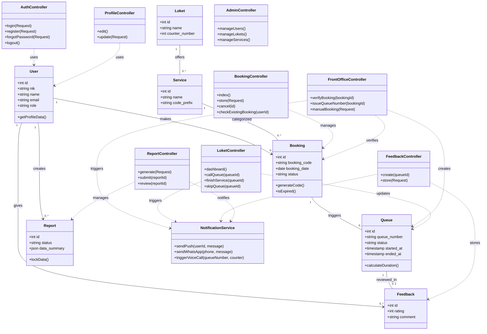

```mermaid
classDiagram
    %% ==========================================
    %% LAYER MODELS (REPRESENTASI DATABASE)
    %% ==========================================
    class User {
        +int id
        +string nik
        +string name
        +string email
        +string role
        +getProfileData()
    }

    class Booking {
        +int id
        +string booking_code
        +date booking_date
        +string status
        +generateCode()
        +isExpired()
    }

    class Queue {
        +int id
        +string queue_number
        +string status
        +timestamp started_at
        +timestamp ended_at
        +calculateDuration()
    }

    class Service {
        +int id
        +string name
        +string code_prefix
    }

    class Loket {
        +int id
        +string name
        +int counter_number
    }

    class Feedback {
        +int id
        +int rating
        +string comment
    }

    class Report {
        +int id
        +string status
        +json data_summary
        +lockData()
    }

    %% ==========================================
    %% LAYER CONTROLLERS (LOGIKA BISNIS)
    %% ==========================================
    class AuthController {
        +login(Request)
        +register(Request)
        +forgotPassword(Request)
        +logout()
    }

    class ProfileController {
        +edit()
        +update(Request)
    }

    class BookingController {
        +index()
        +store(Request)
        +cancel(id)
        +checkExistingBooking(userId)
    }

    class FrontOfficeController {
        +verifyBooking(bookingId)
        +issueQueueNumber(bookingId)
        +manualBooking(Request)
    }

    class LoketController {
        +dashboard()
        +callQueue(queueId)
        +finishService(queueId)
        +skipQueue(queueId)
    }

    class FeedbackController {
        +create(queueId)
        +store(Request)
    }

    class ReportController {
        +generate(Request)
        +submit(reportId)
        +review(reportId)
    }

    class AdminController {
        +manageUsers()
        +manageLokets()
        +manageServices()
    }

    %% ==========================================
    %% LAYER SERVICES (HELPER/AUTOMATION)
    %% ==========================================
    class NotificationService {
        +sendPush(userId, message)
        +sendWhatsApp(phone, message)
        +triggerVoiceCall(queueNumber, counter)
    }

    %% ==========================================
    %% DEFINISI RELASI (ASSOCIATION & DEPENDENCY)
    %% ==========================================

    %% Relationships between Models
    User "1" --> "0..*" Booking : makes
    User "1" --> "0..*" Feedback : gives
    User "1" --> "0..*" Report : creates
    Loket "1" -- "0..*" Service : offers
    Service "1" -- "0..*" Booking : categorized
    Booking "1" -- "0..1" Queue : triggers
    Queue "1" -- "0..1" Feedback : reviewed_in

    %% Controllers Dependency on Models
    AuthController ..> User : uses
    ProfileController ..> User : uses
    BookingController ..> Booking : manages
    FrontOfficeController ..> Booking : verifies
    FrontOfficeController ..> Queue : creates
    LoketController ..> Queue : updates
    FeedbackController ..> Feedback : stores
    ReportController ..> Report : manages

    %% Controllers Dependency on Services
    FrontOfficeController ..> NotificationService : triggers
    LoketController ..> NotificationService : triggers
    FeedbackController ..> NotificationService : notifies
    ReportController ..> NotificationService : notifies
```
