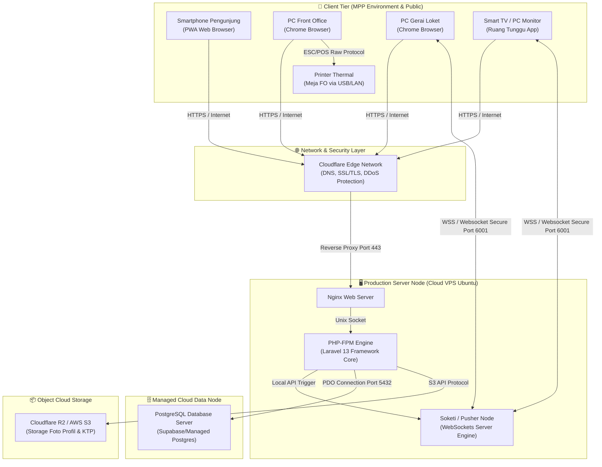

```mermaid
flowchart TB
    %% ==========================================
    %% CLIENT SIDE HARDWARE
    %% ==========================================
    subgraph CLIENT_TIER["📱 Client Tier (MPP Environment & Public)"]
        direction LR
        HP["Smartphone Pengunjung<br/>(PWA Web Browser)"]
        PC_FO["PC Front Office<br/>(Chrome Browser)"]
        PC_LK["PC Gerai Loket<br/>(Chrome Browser)"]
        TV_MON["Smart TV / PC Monitor<br/>(Ruang Tunggu App)"]
        PRINTER["Printer Thermal<br/>(Meja FO via USB/LAN)"]
    end

    %% ==========================================
    %% NETWORK & EDGE SERVICES
    %% ==========================================
    subgraph EDGE_TIER["🌐 Network & Security Layer"]
        CF["Cloudflare Edge Network<br/>(DNS, SSL/TLS, DDoS Protection)"]
    end

    %% ==========================================
    %% SERVER SIDE HARDWARE
    %% ==========================================
    subgraph WEB_SERVER["🖥️ Production Server Node (Cloud VPS Ubuntu)"]
        direction TB
        NGINX["Nginx Web Server"]
        LARAVEL["PHP-FPM Engine<br/>(Laravel 13 Framework Core)"]
        SOKETI["Soketi / Pusher Node<br/>(WebSockets Server Engine)"]
    end

    subgraph DATABASE_TIER["🗄️ Managed Cloud Data Node"]
        DB["PostgreSQL Database Server<br/>(Supabase/Managed Postgres)"]
    end

    subgraph STORAGE_TIER["📦 Object Cloud Storage"]
        R2["Cloudflare R2 / AWS S3<br/>(Storage Foto Profil & KTP)"]
    end

    %% ==========================================
    %% KONEKTIVITAS JARINGAN (PROTOKOL)
    %% ==========================================
    HP & PC_FO & PC_LK & TV_MON ---->|HTTPS / Internet| CF
    CF ---->|Reverse Proxy Port 443| NGINX

    NGINX -->|Unix Socket| LARAVEL
    PC_LK & TV_MON <---->|WSS / Websocket Secure Port 6001| SOKETI
    LARAVEL -->|Local API Trigger| SOKETI

    PC_FO -->|ESC/POS Raw Protocol| PRINTER
    LARAVEL -->|PDO Connection Port 5432| DB
    LARAVEL -->|S3 API Protocol| R2
```
