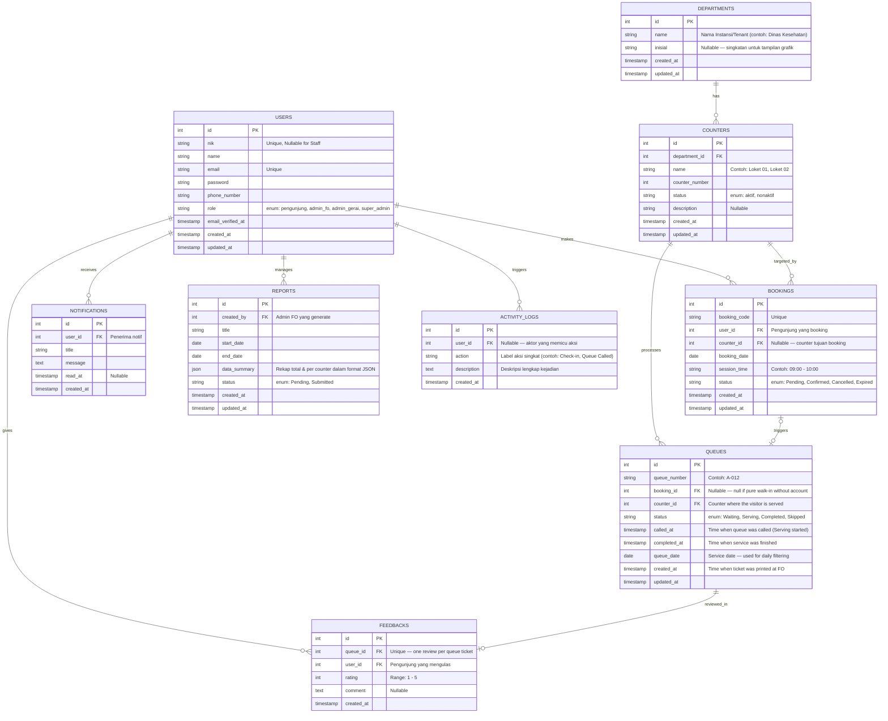

```mermaid
erDiagram
    USERS {
        int id PK
        string nik "Unique, Nullable for Staff"
        string name
        string email "Unique"
        string password
        string phone_number
        string role "enum: pengunjung, admin_fo, admin_gerai, super_admin"
        timestamp email_verified_at
        timestamp created_at
        timestamp updated_at
    }

    DEPARTMENTS {
        int id PK
        string name "Nama Instansi/Tenant (contoh: Dinas Kesehatan)"
        string inisial "Nullable — singkatan untuk tampilan grafik"
        timestamp created_at
        timestamp updated_at
    }

    COUNTERS {
        int id PK
        int department_id FK
        string name "Contoh: Loket 01, Loket 02"
        int counter_number
        string status "enum: aktif, nonaktif"
        string description "Nullable"
        timestamp created_at
        timestamp updated_at
    }

    BOOKINGS {
        int id PK
        string booking_code "Unique"
        int user_id FK "Pengunjung yang booking"
        int counter_id FK "Nullable — counter tujuan booking"
        date booking_date
        string session_time "Contoh: 09:00 - 10:00"
        string status "enum: Pending, Confirmed, Cancelled, Expired"
        timestamp created_at
        timestamp updated_at
    }

    QUEUES {
        int id PK
        string queue_number "Contoh: A-012"
        int booking_id FK "Nullable — null if pure walk-in without account"
        int counter_id FK "Counter where the visitor is served"
        string status "enum: Waiting, Serving, Completed, Skipped"
        timestamp called_at "Time when queue was called (Serving started)"
        timestamp completed_at "Time when service was finished"
        date queue_date "Service date — used for daily filtering"
        timestamp created_at "Time when ticket was printed at FO"
        timestamp updated_at
    }

    FEEDBACKS {
        int id PK
        int queue_id FK "Unique — one review per queue ticket"
        int user_id FK "Pengunjung yang mengulas"
        int rating "Range: 1 - 5"
        text comment "Nullable"
        timestamp created_at
    }

    NOTIFICATIONS {
        int id PK
        int user_id FK "Penerima notif"
        string title
        text message
        timestamp read_at "Nullable"
        timestamp created_at
    }

    REPORTS {
        int id PK
        int created_by FK "Admin FO yang generate"
        string title
        date start_date
        date end_date
        json data_summary "Rekap total & per counter dalam format JSON"
        string status "enum: Pending, Submitted"
        timestamp created_at
        timestamp updated_at
    }

    ACTIVITY_LOGS {
        int id PK
        int user_id FK "Nullable — aktor yang memicu aksi"
        string action "Label aksi singkat (contoh: Check-in, Queue Called)"
        text description "Deskripsi lengkap kejadian"
        timestamp created_at
    }

    %% ==========================================
    %% RELASI ANTAR ENTITAS
    %% ==========================================

    %% Department — Counter (Instansi memiliki banyak Loket)
    DEPARTMENTS ||--o{ COUNTERS : "has"

    %% Users
    USERS ||--o{ BOOKINGS : "makes"
    USERS ||--o{ NOTIFICATIONS : "receives"
    USERS ||--o{ FEEDBACKS : "gives"
    USERS ||--o{ REPORTS : "manages"
    USERS ||--o{ ACTIVITY_LOGS : "triggers"

    %% Counter — Booking & Queue
    COUNTERS ||--o{ BOOKINGS : "targeted_by"
    COUNTERS ||--o{ QUEUES : "processes"

    %% Booking — Queue
    BOOKINGS |o--o| QUEUES : "triggers"

    %% Queue — Feedback
    QUEUES ||--o| FEEDBACKS : "reviewed_in"
```
