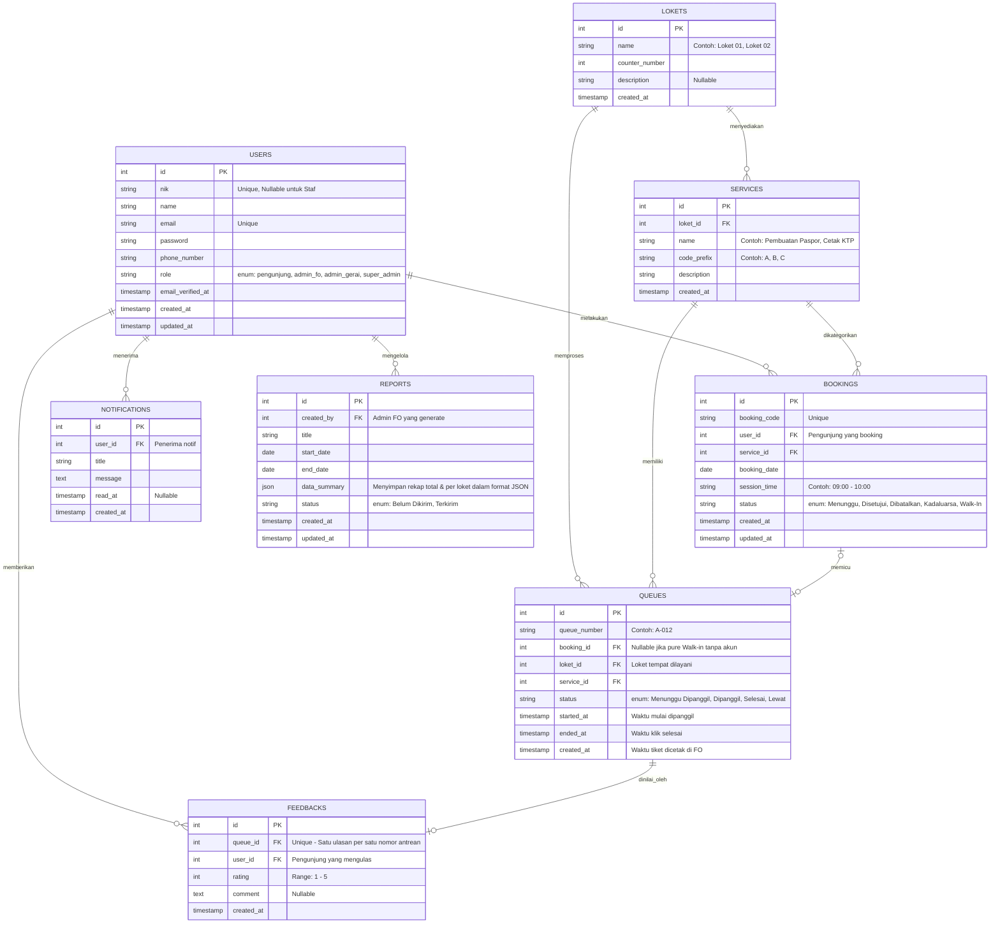

```mermaid
erDiagram
    USERS {
        int id PK
        string nik "Unique, Nullable untuk Staf"
        string name
        string email "Unique"
        string password
        string phone_number
        string role "enum: pengunjung, admin_fo, admin_gerai, super_admin"
        timestamp email_verified_at
        timestamp created_at
        timestamp updated_at
    }

    LOKETS {
        int id PK
        string name "Contoh: Loket 01, Loket 02"
        int counter_number
        string description "Nullable"
        timestamp created_at
    }

    SERVICES {
        int id PK
        int loket_id FK
        string name "Contoh: Pembuatan Paspor, Cetak KTP"
        string code_prefix "Contoh: A, B, C"
        string description
        timestamp created_at
    }

    BOOKINGS {
        int id PK
        string booking_code "Unique"
        int user_id FK "Pengunjung yang booking"
        int service_id FK
        date booking_date
        string session_time "Contoh: 09:00 - 10:00"
        string status "enum: Menunggu, Disetujui, Dibatalkan, Kadaluarsa, Walk-In"
        timestamp created_at
        timestamp updated_at
    }

    QUEUES {
        int id PK
        string queue_number "Contoh: A-012"
        int booking_id FK "Nullable jika pure Walk-in tanpa akun"
        int loket_id FK "Loket tempat dilayani"
        int service_id FK
        string status "enum: Menunggu Dipanggil, Dipanggil, Selesai, Lewat"
        timestamp started_at "Waktu mulai dipanggil"
        timestamp ended_at "Waktu klik selesai"
        timestamp created_at "Waktu tiket dicetak di FO"
    }

    FEEDBACKS {
        int id PK
        int queue_id FK "Unique - Satu ulasan per satu nomor antrean"
        int user_id FK "Pengunjung yang mengulas"
        int rating "Range: 1 - 5"
        text comment "Nullable"
        timestamp created_at
    }

    NOTIFICATIONS {
        int id PK
        int user_id FK "Penerima notif"
        string title
        text message
        timestamp read_at "Nullable"
        timestamp created_at
    }

    REPORTS {
        int id PK
        int created_by FK "Admin FO yang generate"
        string title
        date start_date
        date end_date
        json data_summary "Menyimpan rekap total & per loket dalam format JSON"
        string status "enum: Belum Dikirim, Terkirim"
        timestamp created_at
        timestamp updated_at
    }

    %% ==========================================
    %% DEFINISI RELASI ANTAR ENTITAS
    %% ==========================================
    USERS ||--o{ BOOKINGS : "melakukan"
    USERS ||--o{ NOTIFICATIONS : "menerima"
    USERS ||--o{ FEEDBACKS : "memberikan"
    USERS ||--o{ REPORTS : "mengelola"

    LOKETS ||--o{ SERVICES : "menyediakan"
    LOKETS ||--o{ QUEUES : "memproses"

    SERVICES ||--o{ BOOKINGS : "dikategorikan"
    SERVICES ||--o{ QUEUES : "memiliki"

    BOOKINGS |o--o| QUEUES : "memicu"
    QUEUES ||--o| FEEDBACKS : "dinilai_oleh"
```
