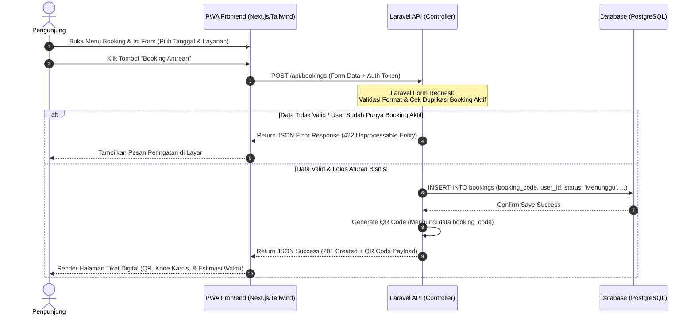

```mermaid
sequenceDiagram
    autonumber
    actor PV as Pengunjung
    participant FE as PWA Frontend (Next.js/Tailwind)
    participant BE as Laravel API (Controller)
    participant DB as Database (PostgreSQL)

    PV->>FE: Buka Menu Booking & Isi Form (Pilih Tanggal & Layanan)
    PV->>FE: Klik Tombol "Booking Antrean"
    FE->>BE: POST /api/bookings (Form Data + Auth Token)

    Note over BE: Laravel Form Request:<br/>Validasi Format & Cek Duplikasi Booking Aktif

    alt Data Tidak Valid / User Sudah Punya Booking Aktif
        BE-->>FE: Return JSON Error Response (422 Unprocessable Entity)
        FE-->>PV: Tampilkan Pesan Peringatan di Layar
    else Data Valid & Lolos Aturan Bisnis
        BE->>DB: INSERT INTO bookings (booking_code, user_id, status: 'Menunggu', ...)
        DB-->>BE: Confirm Save Success
        BE->>BE: Generate QR Code (Mengunci data booking_code)
        BE-->>FE: Return JSON Success (201 Created + QR Code Payload)
        FE-->>PV: Render Halaman Tiket Digital (QR, Kode Karcis, & Estimasi Waktu)
    end
```
