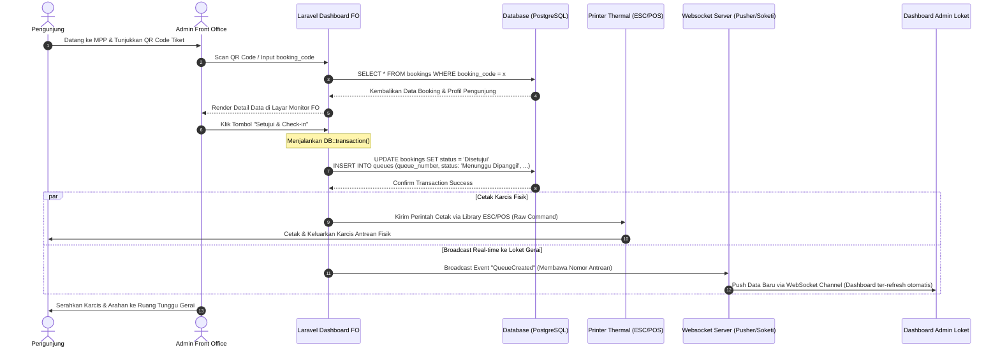

```mermaid
sequenceDiagram
    autonumber
    actor PV as Pengunjung
    actor FO as Admin Front Office
    participant BE as Laravel Dashboard FO
    participant DB as Database (PostgreSQL)
    participant PT as Printer Thermal (ESC/POS)
    participant WS as Websocket Server (Pusher/Soketi)
    participant LK as Dashboard Admin Loket

    PV->>FO: Datang ke MPP & Tunjukkan QR Code Tiket
    FO->>BE: Scan QR Code / Input booking_code
    BE->>DB: SELECT * FROM bookings WHERE booking_code = x
    DB-->>BE: Kembalikan Data Booking & Profil Pengunjung
    BE-->>FO: Render Detail Data di Layar Monitor FO

    FO->>BE: Klik Tombol "Setujui & Check-in"

    Note over BE: Menjalankan DB::transaction()
    BE->>DB: UPDATE bookings SET status = 'Disetujui'<br/>INSERT INTO queues (queue_number, status: 'Menunggu Dipanggil', ...)
    DB-->>BE: Confirm Transaction Success

    par Cetak Karcis Fisik
        BE->>PT: Kirim Perintah Cetak via Library ESC/POS (Raw Command)
        PT->>PV: Cetak & Keluarkan Karcis Antrean Fisik
    and Broadcast Real-time ke Loket Gerai
        BE->>WS: Broadcast Event "QueueCreated" (Membawa Nomor Antrean)
        WS->>LK: Push Data Baru via WebSocket Channel (Dashboard ter-refresh otomatis)
    end

    FO->>PV: Serahkan Karcis & Arahan ke Ruang Tunggu Gerai
```
