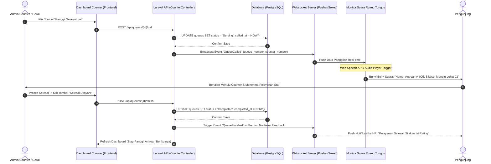

```mermaid
sequenceDiagram
    autonumber
    actor LK as Admin Counter / Gerai
    participant FE_LK as Dashboard Counter (Frontend)
    participant BE as Laravel API (CounterController)
    participant DB as Database (PostgreSQL)
    participant WS as Websocket Server (Pusher/Soketi)
    participant MON as Monitor Suara Ruang Tunggu
    actor PV as Pengunjung

    LK->>FE_LK: Klik Tombol "Panggil Selanjutnya"
    FE_LK->>BE: POST /api/queues/{id}/call
    BE->>DB: UPDATE queues SET status = 'Serving', called_at = NOW()
    DB-->>BE: Confirm Save

    BE->>WS: Broadcast Event "QueueCalled" (queue_number, counter_number)
    WS->>MON: Push Data Panggilan Real-time

    Note over MON: Web Speech API / Audio Player Trigger
    MON->>PV: Bunyi Bel + Suara: "Nomor Antrean A-005, Silakan Menuju Loket 02"

    PV->>LK: Berjalan Menuju Counter & Menerima Pelayanan Staf

    LK->>FE_LK: Proses Selesai -> Klik Tombol "Selesai Dilayani"
    FE_LK->>BE: POST /api/queues/{id}/finish
    BE->>DB: UPDATE queues SET status = 'Completed', completed_at = NOW()
    DB-->>BE: Confirm Save

    BE->>WS: Trigger Event "QueueFinished" -> Pemicu Notifikasi Feedback
    WS-->>PV: Push Notifikasi ke HP: "Pelayanan Selesai, Silakan Isi Rating"
    BE-->>FE_LK: Refresh Dashboard (Siap Panggil Antrean Berikutnya)
```
