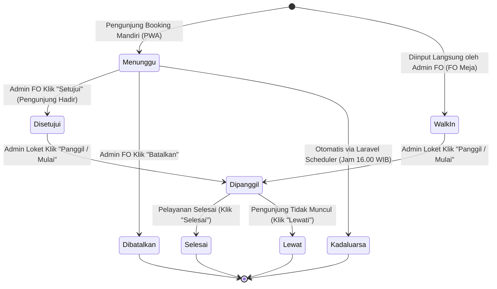

```mermaid
stateDiagram-v2
    classDef statusStyle fill:#bbf,stroke:#333,stroke-width:1px;

    [*] --> Menunggu : Pengunjung Booking Mandiri (PWA)
    [*] --> WalkIn : Diinput Langsung oleh Admin FO (FO Meja)

    state Menunggu :::statusStyle
    state WalkIn :::statusStyle
    state Disetujui :::statusStyle
    state Dibatalkan :::statusStyle
    state Kadaluarsa :::statusStyle
    state Dipanggil :::statusStyle
    state Selesai :::statusStyle
    state Lewat :::statusStyle

    Menunggu --> Disetujui : Admin FO Klik "Setujui" (Pengunjung Hadir)
    Menunggu --> Dibatalkan : Admin FO Klik "Batalkan"
    Menunggu --> Kadaluarsa : Otomatis via Laravel Scheduler (Jam 16.00 WIB)

    Disetujui --> Dipanggil : Admin Loket Klik "Panggil / Mulai"
    WalkIn --> Dipanggil : Admin Loket Klik "Panggil / Mulai"

    Dipanggil --> Selesai : Pelayanan Selesai (Klik "Selesai")
    Dipanggil --> Lewat : Pengunjung Tidak Muncul (Klik "Lewati")

    Selesai --> [*]
    Dibatalkan --> [*]
    Kadaluarsa --> [*]
    Lewat --> [*]
```
