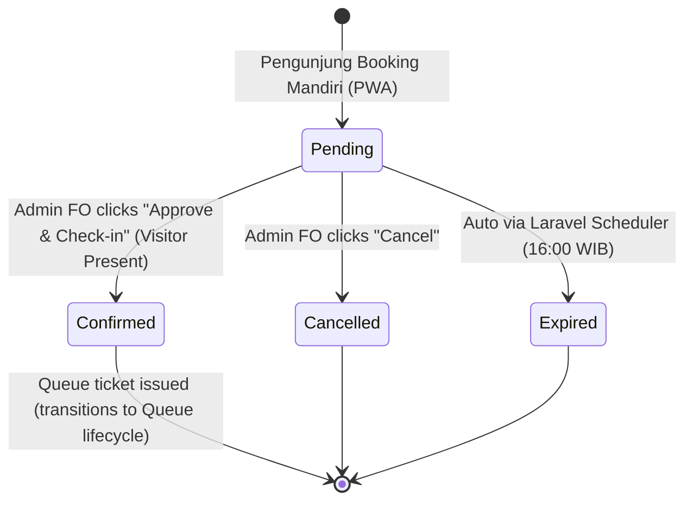
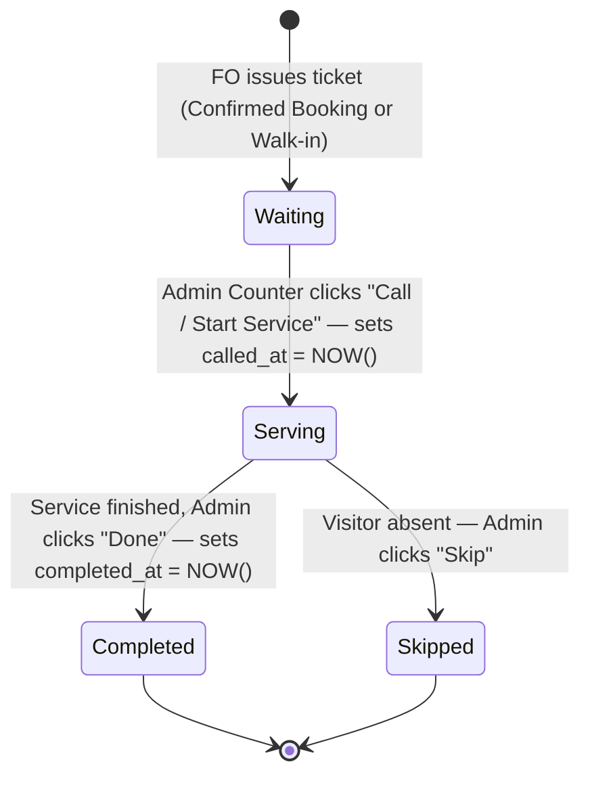

## State Machine — Booking Lifecycle

```mermaid
stateDiagram-v2
    classDef statusStyle fill:#bbf,stroke:#333,stroke-width:1px;

    [*] --> Pending : Pengunjung Booking Mandiri (PWA)

    state Pending :::statusStyle
    state Confirmed :::statusStyle
    state Cancelled :::statusStyle
    state Expired :::statusStyle

    Pending --> Confirmed : Admin FO clicks "Approve & Check-in" (Visitor Present)
    Pending --> Cancelled : Admin FO clicks "Cancel"
    Pending --> Expired : Auto via Laravel Scheduler (16:00 WIB)

    Confirmed --> [*] : Queue ticket issued (transitions to Queue lifecycle)
    Cancelled --> [*]
    Expired --> [*]
```

---

## State Machine — Queue Lifecycle

```mermaid
stateDiagram-v2
    classDef statusStyle fill:#bbf,stroke:#333,stroke-width:1px;

    [*] --> Waiting : FO issues ticket (Confirmed Booking or Walk-in)

    state Waiting :::statusStyle
    state Serving :::statusStyle
    state Completed :::statusStyle
    state Skipped :::statusStyle

    Waiting --> Serving : Admin Counter clicks "Call / Start Service" — sets called_at = NOW()
    Serving --> Completed : Service finished, Admin clicks "Done" — sets completed_at = NOW()
    Serving --> Skipped : Visitor absent — Admin clicks "Skip"

    Completed --> [*]
    Skipped --> [*]
```
