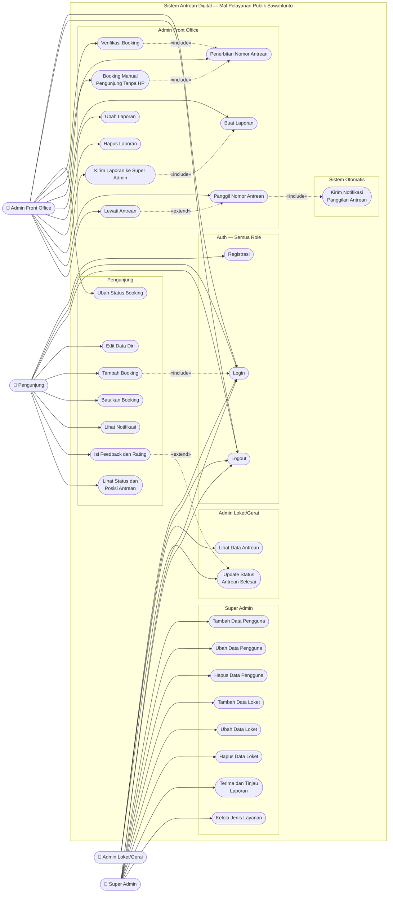

```mermaid
flowchart LR

    PV(["👤 Pengunjung"])
    AFO(["👤 Admin Front Office"])
    ALG(["👤 Admin Loket/Gerai"])
    SA(["👤 Super Admin"])

    subgraph SISTEM["Sistem Antrean Digital — Mal Pelayanan Publik Sawahlunto"]

        subgraph AUTH["Auth — Semua Role"]
            UC1(["Registrasi"])
            UC2(["Login"])
            UC3(["Logout"])
        end

        subgraph PENGUNJUNG["Pengunjung"]
            UC4(["Edit Data Diri"])
            UC5(["Tambah Booking"])
            UC6(["Ubah Status Booking"])
            UC7(["Batalkan Booking"])
            UC8(["Lihat Notifikasi"])
            UC9(["Isi Feedback dan Rating"])
            UC26(["Lihat Status dan\nPosisi Antrean"])
        end

        subgraph FO["Admin Front Office"]
            UC10(["Verifikasi Booking"])
            UC11(["Penerbitan Nomor Antrean"])
            UC12(["Booking Manual\nPengunjung Tanpa HP"])
            UC13(["Buat Laporan"])
            UC14(["Ubah Laporan"])
            UC15(["Hapus Laporan"])
            UC16(["Kirim Laporan ke Super Admin"])
            UC27(["Panggil Nomor Antrean"])
            UC28(["Lewati Antrean"])
        end

        subgraph LOKET["Admin Loket/Gerai"]
            UC17(["Lihat Data Antrean"])
            UC18(["Update Status\nAntrean Selesai"])
        end

        subgraph SUPERADMIN["Super Admin"]
            UC19(["Tambah Data Pengguna"])
            UC20(["Ubah Data Pengguna"])
            UC21(["Hapus Data Pengguna"])
            UC22(["Tambah Data Loket"])
            UC23(["Ubah Data Loket"])
            UC24(["Hapus Data Loket"])
            UC25(["Terima dan Tinjau\nLaporan"])
            UC29(["Kelola Jenis Layanan"])
        end

        subgraph SISTEM_OTOMATIS["Sistem Otomatis"]
            UC30(["Kirim Notifikasi\nPanggilan Antrean"])
        end

    end

    %% Relasi Pengunjung
    PV --> UC1
    PV --> UC2
    PV --> UC3
    PV --> UC4
    PV --> UC5
    PV --> UC7
    PV --> UC8
    PV --> UC9
    PV --> UC26

    %% Relasi Admin Front Office
    AFO --> UC2
    AFO --> UC3
    AFO --> UC6
    AFO --> UC10
    AFO --> UC11
    AFO --> UC12
    AFO --> UC13
    AFO --> UC14
    AFO --> UC15
    AFO --> UC16
    AFO --> UC27
    AFO --> UC28

    %% Relasi Admin Loket/Gerai
    ALG --> UC2
    ALG --> UC3
    ALG --> UC17
    ALG --> UC18

    %% Relasi Super Admin
    SA --> UC2
    SA --> UC3
    SA --> UC19
    SA --> UC20
    SA --> UC21
    SA --> UC22
    SA --> UC23
    SA --> UC24
    SA --> UC25
    SA --> UC29

    %% Include Relationship
    UC5 -.->|«include»| UC2
    UC10 -.->|«include»| UC11
    UC12 -.->|«include»| UC11
    UC16 -.->|«include»| UC13
    UC27 -.->|«include»| UC30

    %% Extend Relationship
    UC9 -.->|«extend»| UC18
    UC28 -.->|«extend»| UC27
```
